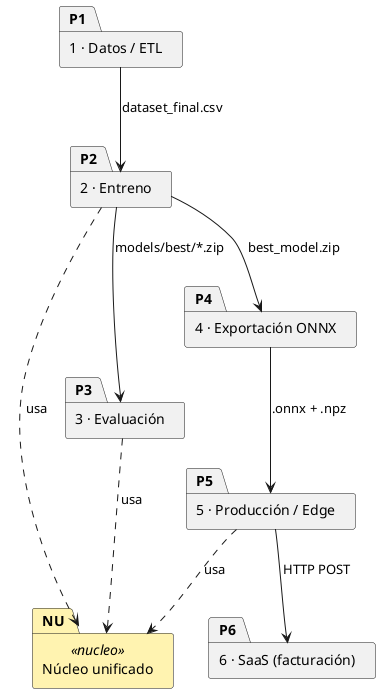
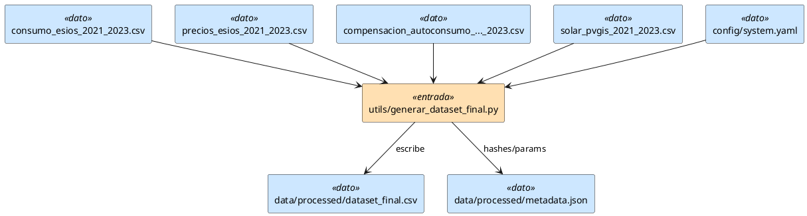
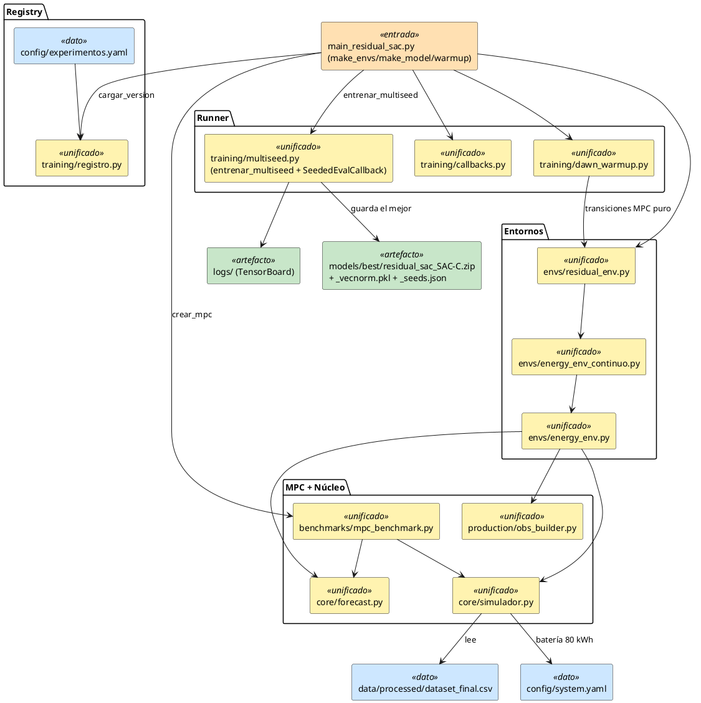
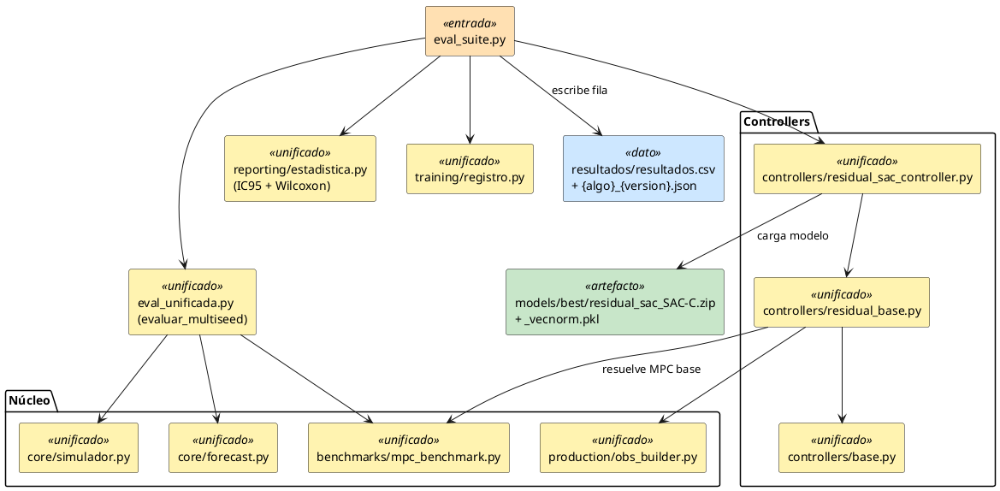
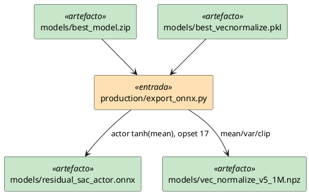
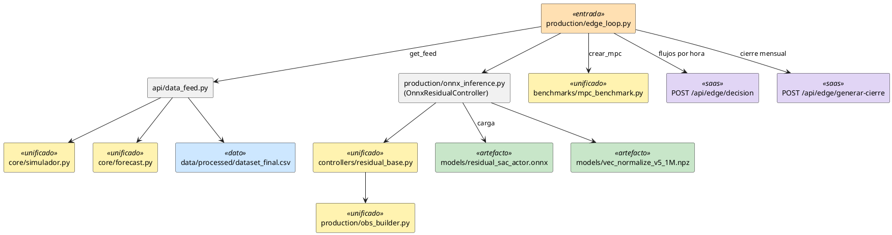
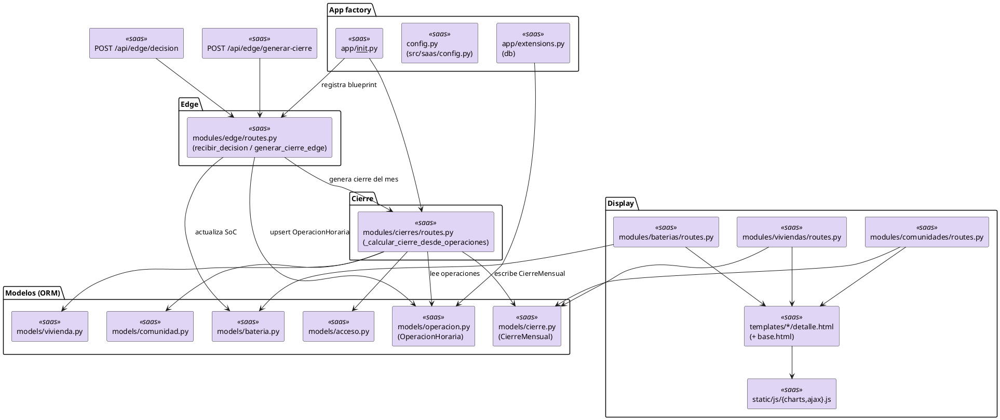
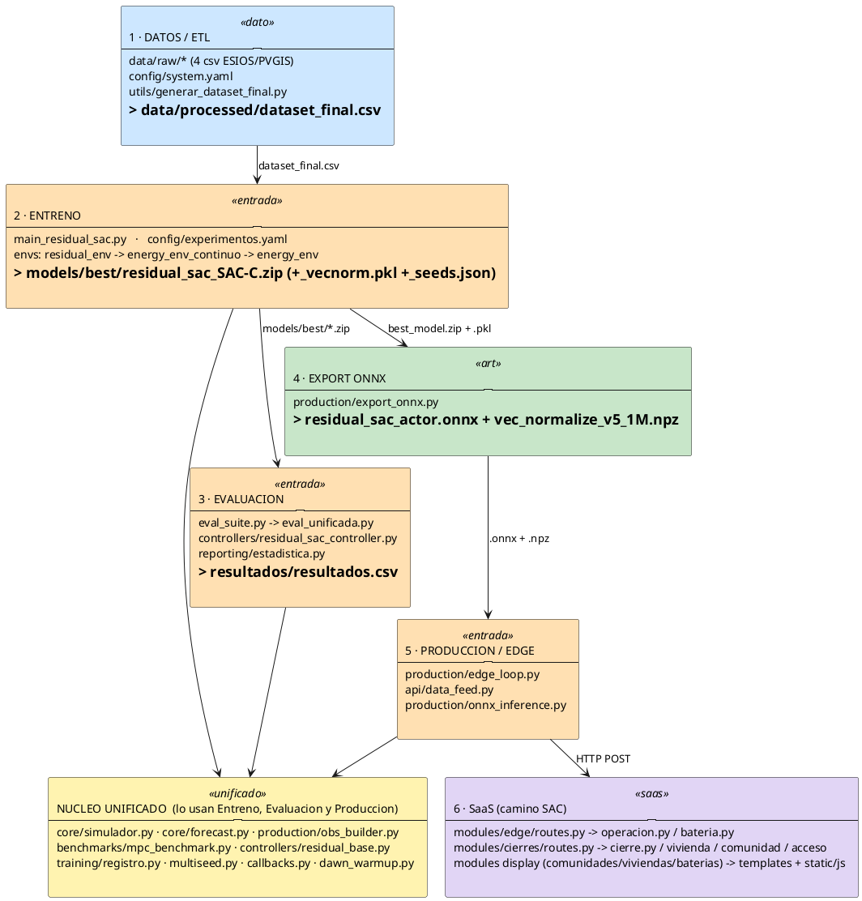

# Flujo completo del Residual SAC — diagramas UML (PlantUML)

Recorrido de **todo el ciclo de vida** del Residual SAC y de cómo va reutilizando el **código
unificado (núcleo)**, desde los datasets crudos hasta la facturación en el SaaS. Para evitar
líneas cruzadas, el ciclo se parte en **7 diagramas** (uno por fase + vista general + núcleo).

> **Cómo verlos:** son bloques PlantUML. Pégalos en [planttext.com](https://www.planttext.com),
> o usa la extensión *PlantUML* de VSCode (Alt+D), o `plantuml.jar`.

## Leyenda (estereotipos / colores)
- 🟡 `<<unificado>>` — módulo **reutilizado por varias fases** (el foco: una pieza, muchos usuarios).
- 🔵 `<<dato>>` — ficheros de datos (csv/json/yaml). 🟢 `<<artefacto>>` — modelos (zip/pkl/onnx/npz).
- 🟠 `<<entrada>>` — scripts de entrada (mains/eval/edge). 🟣 `<<saas>>` — piezas Flask del SaaS.

---

## D0 — Vista general (las 6 fases + el núcleo)

---

## D1 — Datos / ETL

---

## D2 — Entreno del Residual SAC

---

## D3 — Evaluación (eval_suite)

---

## D4 — Exportación a ONNX

---

## D5 — Producción / Edge (inferencia)

---

## D6 — SaaS (solo el camino del SAC: edge → operación → cierre → display)

---

## D7 — El núcleo unificado (una pieza, muchos usuarios)

Muestra de un vistazo cómo **las distintas fases entran a los mismos módulos** → entreno = evaluación
= producción ven exactamente lo mismo.

```plantuml
@startuml D7_nucleo
skinparam componentStyle rectangle
skinparam component {
  BackgroundColor<<unificado>> #FFF3B0
  BackgroundColor<<fase>> #FFE0B2
}
component "FASE Entreno\n(main_residual_sac)"      as F2 <<fase>>
component "FASE Evaluación\n(eval_suite/eval_unificada)" as F3 <<fase>>
component "FASE Producción\n(edge_loop/onnx_inference)"  as F5 <<fase>>

package "NÚCLEO UNIFICADO" {
  component "core/forecast.py\n(ventana + ruido)"       as FC  <<unificado>>
  component "production/obs_builder.py\n(build_obs 108)" as OB  <<unificado>>
  component "core/simulador.py\n(aplicar_fisica_4flujos)" as SIM <<unificado>>
  component "benchmarks/mpc_benchmark.py\n(crear_mpc)"   as MPC <<unificado>>
  component "controllers/residual_base.py\n(solve)"     as RB  <<unificado>>
  component "training/registro.py"                      as REG <<unificado>>
  component "training/multiseed.py"                     as MS  <<unificado>>
  component "training/callbacks.py"                     as CB  <<unificado>>
  component "training/dawn_warmup.py"                   as DW  <<unificado>>
}

F2 --> REG
F2 --> MS
F2 --> CB
F2 --> DW
F2 --> SIM
F2 --> FC
F2 --> OB
F2 --> MPC
F3 --> REG
F3 --> RB
F3 --> SIM
F3 --> FC
F3 --> OB
F3 --> MPC
F5 --> RB
F5 --> SIM
F5 --> FC
F5 --> OB
F5 --> MPC
@enduml
```

---

## D8 — TODO JUNTO (diagrama único, fin a fin)

El ciclo completo en un solo diagrama **legible**: cada fase es **una caja** con sus ficheros
listados dentro, encadenadas de arriba abajo (1 → 2 → … → 6). El **Núcleo unificado** (amarillo)
es una caja aparte a la que bajan Entreno, Evaluación y Producción (una sola flecha cada una). El
detalle fichero-a-fichero (con todas las flechas internas) está en D1–D7.

---

## Tabla índice — todas las piezas que toca el ciclo

`U` = unificado (reutilizado por varias fases).

### Datos / config (7)
| Fichero | Fase | Rol |
|---|---|---|
| `data/raw/consumo_esios_2021_2023.csv` | Datos | demanda horaria cruda (ESIOS) |
| `data/raw/precios_esios_2021_2023.csv` | Datos | PVPC crudo |
| `data/raw/compensacion_autoconsumo_esios_2021_2023.csv` | Datos | precio excedente |
| `data/raw/solar_pvgis_2021_2023.csv` | Datos | generación solar (PVGIS) |
| `data/processed/dataset_final.csv` | Datos→Entreno/Eval/Prod | dataset final (entrada del simulador) |
| `data/processed/metadata.json` | Datos | parámetros + hashes |
| `config/system.yaml` | **U** todas | config (batería 80 kWh, ruido, MPC, split) |

### Núcleo unificado (9)
| Fichero | Fases | Rol |
|---|---|---|
| `src/core/simulador.py` | **U** Entreno/Eval/Prod | física de batería (`aplicar_fisica_4flujos`) |
| `src/core/forecast.py` | **U** Entreno/Eval/Prod | ventana + ruido (`ventana_observada`) |
| `src/production/obs_builder.py` | **U** Entreno/Eval/Prod | observación de 108 dims (`build_obs`) |
| `src/benchmarks/mpc_benchmark.py` | **U** Entreno/Eval/Prod | MPC LP (`crear_mpc`, `LinearMPC`) |
| `src/controllers/residual_base.py` | **U** Eval/Prod | `solve()` residual común (torch/onnx) |
| `src/training/registro.py` | **U** Entreno/Eval | loader de la registry |
| `src/training/multiseed.py` | **U** Entreno | runner + `SeededEvalCallback` |
| `src/training/callbacks.py` | **U** Entreno | callbacks de métricas + `EntCoefScheduler` |
| `src/training/dawn_warmup.py` | **U** Entreno | warmup MPC del buffer |

### Entornos + buffers (4)
| Fichero | Fase | Rol |
|---|---|---|
| `src/envs/residual_env.py` | Entreno | wrapper residual (mult/add) sobre el MPC |
| `src/envs/energy_env_continuo.py` | Entreno | entorno continuo Box-4 (hereda del discreto) |
| `src/envs/energy_env.py` | Entreno | entorno base (obs, reset, step) |
| `src/buffers/nstep_replay_buffer.py` | Entreno (DQN) | buffer N-step (no lo usa el SAC; del registry general) |

### Entreno (entrada + registry) (3)
| Fichero | Fase | Rol |
|---|---|---|
| `src/main_residual_sac.py` | Entreno | entrada: factorías + lanza `entrenar_multiseed` |
| `config/experimentos.yaml` | Entreno/Eval | hiperparámetros de cada versión (SAC-C…) |
| `src/training/action_noise.py` | Entreno (TD3/DDPG) | ruido exploración (no SAC; del núcleo de la suite) |

### Controllers (6)
| Fichero | Fase | Rol |
|---|---|---|
| `src/controllers/base.py` | **U** Eval/Prod | interfaz `solve()` |
| `src/controllers/residual_sac_controller.py` | Eval | carga el `.zip` torch (SAC/TD3/DDPG) |
| `src/controllers/discrete_rl_controller.py` | Eval (DQN/PPO) | controller discreto |
| `src/controllers/continuous_controller.py` | Eval (PPO-cont/SAC-puro) | continuo sin MPC |
| `src/controllers/heuristic_controller.py` | Eval (baseline) | reglas if-then |
| `src/controllers/residual_base.py` | (ver núcleo) | base común |

### Evaluación (4)
| Fichero | Fase | Rol |
|---|---|---|
| `src/eval_suite.py` | Eval | dispatcher por familia + estadística → CSV |
| `src/eval_unificada.py` | **U** Eval | motor de evaluación (50 semanas, multiseed) |
| `src/reporting/estadistica.py` | Eval | IC95 bootstrap + Wilcoxon |
| `resultados/resultados.csv` | Eval (salida) | una fila por versión (→ tablas LaTeX) |

### Producción / Edge (4 + artefactos)
| Fichero | Fase | Rol |
|---|---|---|
| `src/production/export_onnx.py` | Export | `.zip`+`.pkl` → `.onnx`+`.npz` |
| `src/production/edge_loop.py` | Prod | bucle edge: decide y postea al SaaS |
| `src/production/onnx_inference.py` | Prod | `OnnxResidualController` (ONNX) |
| `src/api/data_feed.py` | Prod | feed de datos (histórico/simulado) |
| `models/best_model.zip` · `best_vecnormalize.pkl` | artefactos | modelo torch + normalización |
| `models/residual_sac_actor.onnx` · `vec_normalize_v5_1M.npz` | artefactos | modelo edge + stats |

### SaaS — solo el camino del SAC (~22)
> Rutas relativas a `src/saas/` (el paquete Flask se llama `app`; `config.py` está en `src/saas/config.py`).

| Fichero | Rol |
|---|---|
| `app/__init__.py` · `config.py` · `app/extensions.py` | app factory + `db` |
| `src/saas/run.py` · `seed.py` | arranque + carga inicial de datos |
| `app/modules/edge/routes.py` | recibe `/decision` y `/generar-cierre` del edge |
| `app/modules/cierres/routes.py` (+ `forms.py`) | `_calcular_cierre_desde_operaciones` |
| `app/modules/comunidades/routes.py` · `viviendas/routes.py` · `baterias/routes.py` | display/facturación |
| `app/models/operacion.py` (`OperacionHoraria`) | guarda cada hora del edge |
| `app/models/bateria.py` · `cierre.py` (`CierreMensual`) | estado batería + cierre mensual |
| `app/models/vivienda.py` · `comunidad.py` · `acceso.py` | reparto por vivienda |
| `app/helpers.py` · `decorators.py` | utilidades/permisos |
| `app/templates/{cierres,comunidades,baterias}/detalle.html` · `base.html` | vistas |
| `app/static/js/charts.js` · `ajax.js` | gráficas + interacción |

> **Lectura del ciclo en una línea:** datos crudos → `dataset_final.csv` → **entreno** (main_residual_sac
> usa todo el núcleo + `multiseed`) → `models/best/*.zip` → **eval** (eval_suite, mismo núcleo) →
> **export** a `.onnx` → **edge** (onnx_inference, mismo núcleo) → **POST** al **SaaS** → operación →
> cierre mensual → facturación por vivienda. El **núcleo unificado** (D7) es el que atraviesa entreno,
> eval y producción garantizando que ven lo mismo.
